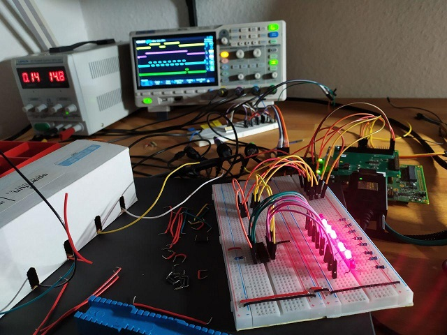

# tpic6c595
A linux kernel module for the tpic6c595 shift-register. The tpic6c595 is a 8-bit shift register by Texas Instruments. It's typically used for power driver applications including relays, solenoids, and other low-current or medium-voltage loads. 

The tpic6c595 can be chained with other registers of the same type, thus providing any multiple of eight outputs. This way it can be used to provide a plethora of output pins by using only four GPIOs.

By using this kernel driver the shift-register can be directly accessed through a character-device located at `/dev/tpic6c595`. The driver can be configured through `ioctl()` and supports the `write()`-call to set it's pins by writing bitmasks to it.

### Button
This project was created to demonstrate the development of a linux-module. For demonstration purpose, an interrupt-handler is registered to be fired when the user hits a hardware-button. The function of the button can be configured and is demonstrated in the example-section.

### Example
`tpic6c595_test.c` contains an example program that uses the driver to control the shift-register from userspace. A prototype PCB was soldered to show the functionality the of the driver. It uses two tpic6c595 shift-registers to supply a total of 16 outputs. These outputs can be accessed through pin-headers on the PCB and their status is indicated by LEDs.

The button is configured to give a knight-rider like effect:

The button is configured to flash the outputs, doesn't look right on the gif because of the low frame-rate:

Ascending values from 0x0000 to 0xffff are written to the device:

### Development
During development a test-setup was used and the correctness of the signals was observed using an oscilloscope.

